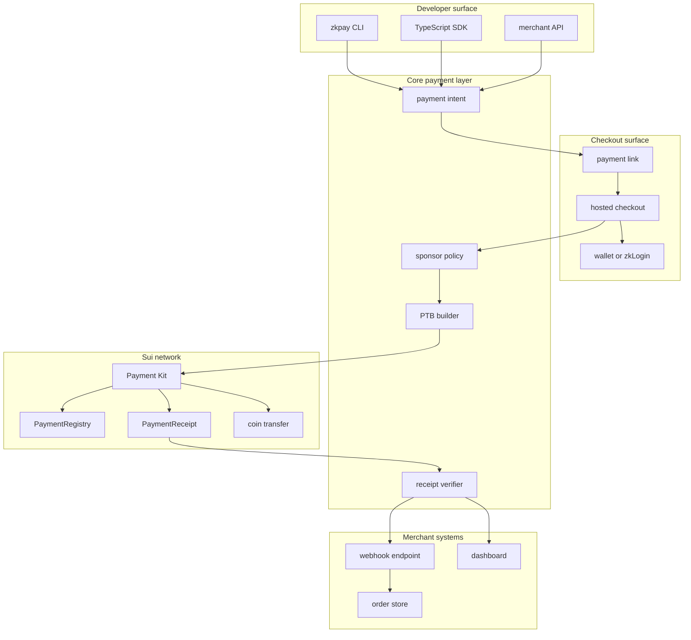

# Sui zkPay Design

`zkpay.sh` is stablecoin checkout infrastructure for Sui applications.

The current product narrative source of truth is the zkpay product deck:

- `outputs/019e540d-4b42-7f43-a0d0-c67c624f0ee5/presentations/zkpay-product-pdf/output/zkpay-first.pdf`
- `outputs/019e540d-4b42-7f43-a0d0-c67c624f0ee5/presentations/zkpay-product-pdf/output/zkpay-first-en.pdf`

Future product implementation should follow the deck's product logic:

```txt
zkpay is Sui-native stablecoin checkout infrastructure.
Payment Links -> zkLogin Checkout -> Gas Routing -> Receipt Verification.
MVP loop: create link -> open checkout -> authorize -> route gas -> settle -> notify/verify.
```

The website should not look like the deck wrapped in HTML. The deck is the
source of truth for positioning and product logic; the website should translate
that logic into a product page for developers, merchants, and Sui app builders.

```txt
Hero: stablecoin checkout without wallet and gas friction
-> What zkpay removes for payers, apps, and merchants
-> Why Sui primitives make this possible
-> Checkout flow from intent to verified receipt
-> Core capabilities
-> Developer integration surface
-> Clear gas policy and product boundary
```

The first useful version should focus on payment experience, not full payment
anonymity:

```txt
Stablecoin checkout without seed phrases or SUI gas friction.
Payment links. zkLogin authorization. Gas routing. Receipt verification.
Verifiable onchain receipts.
```

The product uses Sui's strengths: protocol-level gasless stablecoin transfers
for supported payment flows, zkLogin for onboarding, sponsored transactions for
checkout flows that need extra logic, Payment Kit for standardized receipts,
and programmable transaction blocks for payment intents.

## Product Thesis

Most crypto payment products fail before the payment happens. Users need a
wallet, seed phrase, gas token, correct chain, correct token, and confidence
that the transaction does what the checkout says.

Sui has primitives that let a payment product remove much of that friction:

- Gasless stablecoin transfers can remove the need to hold SUI for supported
  peer-to-peer stablecoin payments.
- zkLogin can onboard users with familiar OAuth credentials.
- Sponsored transactions let the merchant or app pay gas when the flow goes
  beyond supported gasless transfer rails.
- Payment Kit standardizes payment links, receipts, registries, and duplicate
  prevention.
- Programmable transaction blocks can combine swap, transfer, deposit, and
  receipt creation into one signed atomic action.

The first `zkpay.sh` release should turn those primitives into a developer
tool that feels closer to a Stripe payment link than a wallet flow.

## Positioning

Shortest positioning:

```txt
Stablecoin checkout for Sui apps.
```

Infrastructure positioning:

```txt
Sui-native stablecoin checkout infrastructure.
```

Fuller positioning:

```txt
zkpay.sh is Sui-native stablecoin checkout infrastructure that lets developers
create payment links, hosted checkout flows, gasless stablecoin routes, smart
gas fallbacks, and verifiable onchain receipts with zkLogin and Sui Payment Kit.
```

Plain-language positioning:

```txt
Sui 上的免助记词、免持 SUI 稳定币支付基础设施。
```

The "zk" in the first version is intentionally narrow. It comes from zkLogin
and privacy-preserving authentication, not from a claim that payments are fully
anonymous or confidential.

## Target Users

Primary users:

- Sui app developers who need payment links or checkout.
- Indie builders selling digital goods, API credits, subscriptions, or
  memberships.
- Games and consumer apps that want users to pay without managing seed phrases.
- AI agent apps that need predictable onchain payment receipts.

Secondary users:

- Merchants who want stablecoin receipts without building wallet flows.
- Wallet and infrastructure teams that want a clean payment intent surface.

## MVP Definition

The MVP should let a developer create a payment link, let a payer complete the
payment with a wallet or zkLogin account, and let the merchant verify the
receipt.

```txt
merchant creates payment link
-> payer opens hosted checkout
-> payer signs once with wallet or zkLogin account
-> eligible stablecoin transfer uses Sui's gasless route
-> sponsor or payer-paid fallback handles richer checkout logic
-> Sui transaction transfers funds and emits/verifies receipt data
-> merchant verifies receipt or receives webhook
```

The MVP is complete when this flow works on Sui mainnet or testnet for one
supported stablecoin and one merchant receiver.

## Product Surface

### CLI

The CLI is for developers and early merchants.

```bash
zkpay init
zkpay merchant create --name "Acme Labs" --receiver 0x...
zkpay link create --amount 20 --coin USDC --label "API credits"
zkpay receipt verify zkp_...
```

Initial output:

```txt
https://zkpay.sh/pay/zkp_123
```

The CLI should support JSON output from the start:

```bash
zkpay link create --amount 20 --coin USDC --label "API credits" --json
```

### TypeScript SDK

The SDK is the main integration surface for apps.

```ts
const payment = await zkpay.createPayment({
  amount: "20",
  coinType: "USDC",
  receiver: merchantAddress,
  label: "API credits",
  metadata: {
    orderId: "ord_123"
  }
});

const receipt = await zkpay.verifyPayment(payment.id);
```

SDK responsibilities:

- create payment links;
- build Sui payment transaction data;
- parse and validate payment URI fields;
- verify receipts by transaction digest or payment id;
- expose sponsor eligibility results;
- normalize errors for checkout and server integrations.

### Hosted Checkout

The hosted checkout should be a thin product surface over the SDK.

The payer sees:

- merchant label;
- amount;
- coin;
- receiver identity;
- payment message;
- wallet or zkLogin authentication option;
- final transaction confirmation;
- receipt after success.

The checkout should not custody funds. It should build a transaction, ask the
user to authorize it, and then verify the resulting transaction.

### Webhooks

Webhooks are optional in the first local prototype, but they are important for
real merchants.

```json
{
  "type": "payment.succeeded",
  "paymentId": "zkp_123",
  "txDigest": "9T...",
  "amount": "20",
  "coinType": "USDC",
  "receiver": "0x...",
  "timestampMs": 1760000000000
}
```

Webhook signing should be required before production use.

## System Architecture



## Payment Model

The first version should align with Sui Payment Kit instead of inventing a
separate receipt format.

Core fields:

| Field | Role |
| --- | --- |
| `paymentId` | zkpay identifier for the checkout session. |
| `nonce` | Payment Kit nonce used for duplicate prevention. |
| `amount` | Expected amount in base units. |
| `coinType` | Sui coin type. |
| `receiver` | Merchant or registry receiver address. |
| `label` | Human-readable merchant or order label. |
| `message` | Optional checkout context. |
| `metadataHash` | Optional hash of private merchant metadata. |
| `expiresAt` | Time after which checkout should refuse execution. |

The public payment URL can hide internal metadata behind a short id:

```txt
https://zkpay.sh/pay/zkp_123
```

The underlying Sui payment URI should remain exportable:

```txt
sui:pay?receiver=0x...&amount=20000000&coinType=USDC&nonce=...
```

## Onchain Boundary

The Move layer should be as small as possible in v0.

Use Sui Payment Kit for:

- payment processing;
- receipts;
- duplicate prevention;
- registry payments when durable tracking is required;
- ephemeral payments when an app handles tracking offchain.

Only add custom Move code when a real gap appears, such as:

- merchant registry ownership;
- metadata commitment verification;
- custom split settlement;
- application-specific escrow or refund rules.

Avoid custom cryptography in the first version.

## Sponsored Gas Policy

Sponsored gas is a product feature and a risk surface. It needs a policy layer
from the beginning.

Suggested v0 policy checks:

| Check | Outcome |
| --- | --- |
| Merchant is verified | Required for sponsored gas. |
| Payment link is not expired | Required. |
| Amount is below sponsor cap | Required. |
| Coin type is allowlisted | Required. |
| Receiver matches payment intent | Required. |
| Nonce has not already succeeded | Required. |
| Rate limit is healthy | Required for hosted sponsor. |

Policy outcomes:

| Outcome | Meaning |
| --- | --- |
| `sponsor_allowed` | Checkout can request a sponsored transaction. |
| `payer_pays_gas` | Payment is valid, but payer must pay gas. |
| `blocked` | Checkout must not build or submit the transaction. |

## zkLogin Role

zkLogin should be treated as onboarding infrastructure:

```txt
OAuth credential
-> zkLogin proof
-> Sui address
-> payment authorization
```

What zkLogin gives the product:

- users can pay without seed phrases;
- apps can create invisible-wallet flows;
- users can start from Web2 identity and still authorize onchain actions;
- the app can sponsor gas to avoid requiring SUI before first payment.

What zkLogin does not give by itself:

- it does not hide payment amounts;
- it does not hide sender or receiver addresses;
- it does not make payment history confidential;
- it does not remove the need for transaction consent and risk controls.

This distinction should be visible in docs and marketing.

## Privacy Direction

The first version should avoid claiming confidential payments.

Accurate wording:

```txt
zkLogin-powered payment UX.
```

Avoid:

```txt
anonymous payments
private stablecoin transfers
confidential payments
untraceable checkout
```

Future privacy features can be explored after the base payment system is
working:

- metadata minimization;
- private merchant metadata stored offchain;
- metadata commitments in receipts;
- selective disclosure for accounting;
- encrypted invoices;
- permissioned asset flows for regulated issuers;
- confidential settlement if Sui ecosystem primitives mature.

## API Sketch

### Create Payment

```http
POST /v1/payments
```

Request:

```json
{
  "amount": "20",
  "coinType": "USDC",
  "receiver": "0x...",
  "label": "API credits",
  "message": "Acme API credits",
  "metadata": {
    "orderId": "ord_123"
  }
}
```

Response:

```json
{
  "id": "zkp_123",
  "status": "created",
  "paymentUrl": "https://zkpay.sh/pay/zkp_123",
  "suiUri": "sui:pay?receiver=0x...&amount=20000000&coinType=USDC&nonce=...",
  "expiresAt": "2026-05-20T12:00:00.000Z"
}
```

### Build Transaction

```http
POST /v1/payments/zkp_123/transaction
```

Response:

```json
{
  "paymentId": "zkp_123",
  "sponsor": {
    "decision": "sponsor_allowed",
    "reasons": []
  },
  "transactionKind": "sponsored",
  "bytes": "..."
}
```

### Verify Payment

```http
GET /v1/payments/zkp_123
```

Response:

```json
{
  "id": "zkp_123",
  "status": "succeeded",
  "txDigest": "9T...",
  "receipt": {
    "nonce": "550e8400-e29b-41d4-a716-446655440000",
    "amount": "20000000",
    "coinType": "USDC",
    "receiver": "0x...",
    "timestampMs": 1760000000000
  }
}
```

## Repository Shape

The project can start as a monorepo:

```txt
packages/
  cli/
  sdk/
  checkout/
  server/
move/
  zkpay/
docs/
  design.md
  api.md
  checkout.md
  sponsor-policy.md
examples/
  nextjs-checkout/
  merchant-webhook/
```

The Move package should stay optional until a concrete need exists beyond Sui
Payment Kit.

## Web App Stack Option

The current `zkpay.sh` site can stay static while the product surface is still
being shaped. When it grows into hosted checkout, merchant APIs, webhooks, and
dashboard views, consider this stack:

```txt
Cloudflare + TanStack Start + TanStack Router + Hono
```

Why it may fit:

- Cloudflare Workers/Pages match a lightweight payment-link and checkout edge
  deployment model.
- TanStack Start can provide a React full-stack app without committing to a
  heavier framework too early.
- TanStack Router gives typed routes and data loading for `/pay/:id`,
  dashboard, docs, and admin surfaces.
- Hono is a small API layer that runs well on Cloudflare for payment creation,
  receipt verification, webhook endpoints, and sponsor/gas routing decisions.

This is a candidate for the checkout/API application, not a requirement for
the current static marketing page.

## Milestones

### v0.1: Stablecoin Payment URI and SDK

- create and parse payment requests;
- validate amount, coin type, receiver, nonce, expiration;
- produce Sui payment URI;
- verify local receipt fields against a payment intent;
- no hosted custody;
- no custom sponsor policy yet.

### v0.2: Testnet Settlement Loop

- hosted `/pay/:id` page;
- wallet-submittable Sui transaction builder;
- Sui RPC receipt verification by digest, receiver, coin type, and amount;
- `/payments/verify/sui` API route;
- CLI receipt verification for demos and scripts;
- signed payment intents and signed webhook event primitives;
- local webhook signing and verification for scripts;
- opt-in HTTP webhook dispatcher for merchant callbacks;
- merchant-side digest replay storage still required.

### v0.3: zkLogin Checkout

- zkLogin auth path;
- payer account creation;
- transaction authorization with zkLogin account;
- fallback to wallet path.

### v0.4: Gas Routing

- gasless stablecoin transfer routing;
- sponsor policy engine;
- sponsored transaction builder;
- merchant allowlist;
- rate limits and amount caps;
- payer-pays-gas fallback.

### v0.5: Merchant Webhooks

- webhook endpoint registration;
- retries and delivery logs;
- production delivery observability.

### v1.0: Payment Intents

- swap-then-pay;
- split settlement;
- registry-based payments;
- duplicate prevention;
- production documentation and examples.

## Open Questions

- Which stablecoin should be first: USDC for ecosystem reach, or USDsui for
  native Sui alignment?
- Should hosted payment links be stored by zkpay, merchant-hosted, or both?
- Should the default payment path use Sui Payment Kit registry payments or
  ephemeral payments?
- What is the minimum safe sponsor policy for a public demo?
- Should merchant identity be represented by SuiNS, a zkpay registry, or an
  offchain profile in v0?
- How much checkout metadata should be public, hashed, or stored offchain?

## Recommendation

Build the first prototype as:

```txt
Sui testnet payment links
-> wallet checkout
-> receipt verification
-> zkLogin
-> sponsored gas
```

This order keeps the payment core testable before adding the more delicate
onboarding and sponsorship layers. It also makes the project honest: the first
release is a usable Sui payment kit, and the ZK part arrives through zkLogin
instead of unsupported privacy claims.
